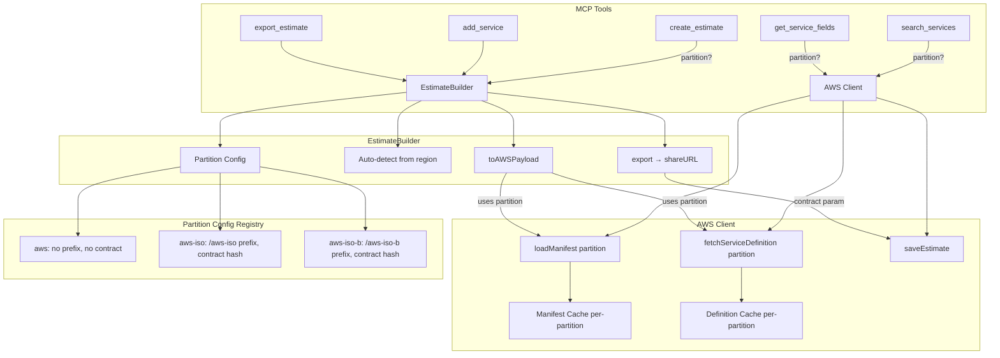

# Design Document: ISO Partition Support

## Overview

This feature extends the AWS Pricing Calculator MCP server to support the AWS ISO (Top Secret) and ISO-B (Secret) partitions alongside the existing commercial (`aws`) partition. The core change introduces a partition configuration registry that drives manifest loading, service definition fetching, region mapping, and share URL generation — all keyed by a partition identifier (`aws`, `aws-iso`, `aws-iso-b`).

The design prioritizes backward compatibility: when no partition is specified, the system behaves identically to today. Partition awareness flows through three layers:

1. **AWS Client** — partition-keyed manifest/definition fetching and caching
2. **Estimate Builder** — partition storage, auto-detection from regions, and share URL formatting
3. **MCP Server** — new optional `partition` parameter on tools

All three partitions share the same CDN base (`https://d1qsjq9pzbk1k6.cloudfront.net`) and save API endpoint (`https://dnd5zrqcec4or.cloudfront.net/Prod/v2/saveAs`). The difference is the URL path prefix for manifests and service definitions, the set of available regions, and the contract parameter appended to share URLs for non-commercial partitions.

## Architecture



### Key Design Decisions

1. **Centralized partition config in `aws-client.js`**: A single `PARTITIONS` object maps each partition ID to its manifest path, CDN prefix, regions, and contract parameter. This avoids scattering partition logic across modules.

2. **Per-partition caching**: The current singleton `manifestPromise` and flat `definitionCache` are replaced with partition-keyed Maps. This ensures loading `aws-iso` data never overwrites `aws` cached data.

3. **Partition auto-detection**: When no explicit partition is set on an estimate, the system infers it from the region prefix (`us-iso-` → `aws-iso`, `us-isob-` → `aws-iso-b`). This reduces friction for users who just specify a region.

4. **Mixed-partition validation**: If services in a single estimate reference regions from different partitions, the system returns an error at export time rather than silently producing an invalid estimate.

5. **Contract-based share URLs**: Non-commercial partitions use a contract parameter (`ctrct=5423f8cd3b711c6f899ba4dade31b50c`) in the share URL. The `aws` partition continues to use the existing URL format.

## Components and Interfaces

### 1. Partition Configuration Registry (`lib/aws-client.js`)

```javascript
const PARTITIONS = {
  'aws': {
    manifestPath: '/manifest/en_US.json',
    cdnPrefix: '',
    contract: null,
    regions: {
      // all existing commercial regions (unchanged)
    }
  },
  'aws-iso': {
    manifestPath: '/aws-iso/manifest/en_US.json',
    cdnPrefix: '/aws-iso',
    contract: '5423f8cd3b711c6f899ba4dade31b50c',
    regions: {
      'us-iso-east-1': 'US ISO East',
      'us-iso-west-1': 'US ISO West',
    }
  },
  'aws-iso-b': {
    manifestPath: '/aws-iso-b/manifest/en_US.json',
    cdnPrefix: '/aws-iso-b',
    contract: '5423f8cd3b711c6f899ba4dade31b50c',
    regions: {
      'us-isob-east-1': 'US ISOB East (Ohio)',
    }
  }
};
```

### 2. AWS Client API Changes (`lib/aws-client.js`)

Updated function signatures:

| Function | Current | New |
|---|---|---|
| `loadManifest()` | No params, singleton cache | `loadManifest(partition = 'aws')`, per-partition cache |
| `fetchServiceDefinition(manifest, serviceCode)` | Flat cache | `fetchServiceDefinition(manifest, serviceCode, partition = 'aws')`, partition-keyed cache |
| `searchServices(manifest, query)` | No change | No change (operates on already-loaded manifest) |
| `saveEstimate(payload)` | Returns `shareableUrl` | No change (URL construction moves to EstimateBuilder) |

New exports:
- `PARTITIONS` — the partition config registry
- `resolvePartition(region)` — returns partition ID for a given region, or `'aws'` as default

### 3. EstimateBuilder Changes (`lib/estimate-builder.js`)

```javascript
class EstimateBuilder {
  constructor(name = 'My Estimate', partition = null) {
    // ... existing fields ...
    this.partition = partition; // explicit partition, or null for auto-detect
  }

  // Resolves the effective partition: explicit > auto-detected from regions > 'aws'
  _resolvePartition() { ... }

  // Validates all services target the same partition
  _validatePartitionConsistency() { ... }

  async toAWSPayload() {
    const partition = this._resolvePartition();
    this._validatePartitionConsistency();
    const manifest = await loadManifest(partition);
    // ... rest uses partition for fetchServiceDefinition ...
  }

  async export() {
    const payload = await this.toAWSPayload();
    const result = await saveEstimate(payload);
    const partition = this._resolvePartition();
    return {
      estimateId: result.estimateId,
      shareableUrl: this._buildShareUrl(result.estimateId, partition),
    };
  }

  _buildShareUrl(savedKey, partition) {
    const contract = PARTITIONS[partition]?.contract;
    if (contract) {
      return `https://calculator.aws/#/?ctrct=${contract}#/estimate?id=${savedKey}`;
    }
    return `https://calculator.aws/#/estimate?id=${savedKey}`;
  }
}
```

The `REGIONS` map is extended with ISO/ISO-B regions. The existing commercial regions remain unchanged.

### 4. MCP Server Changes (`mcp-server.js`)

New optional `partition` parameter added to:
- `search_services` — passes partition to `loadManifest(partition)`
- `get_service_fields` — passes partition to `loadManifest(partition)` and `fetchServiceDefinition(..., partition)`
- `create_estimate` — stores partition on the `EstimateBuilder` instance

The `add_service` and `export_estimate` tools require no new parameters — they use the partition already stored on the estimate (or auto-detect from regions).

### 5. Region Resolution Utility (`lib/aws-client.js`)

```javascript
function resolvePartition(region) {
  if (!region) return 'aws';
  if (region.startsWith('us-iso-')) return 'aws-iso';
  if (region.startsWith('us-isob-')) return 'aws-iso-b';
  return 'aws';
}
```

## Data Models

### Partition Config Object

```typescript
interface PartitionConfig {
  manifestPath: string;     // e.g. '/aws-iso/manifest/en_US.json'
  cdnPrefix: string;        // e.g. '/aws-iso' or '' for commercial
  contract: string | null;  // contract hash for share URLs, null for commercial
  regions: Record<string, string>; // regionId → display name
}
```

### Cache Structures

```
// Before (current)
manifestPromise: Promise<Map> | null          // single manifest
definitionCache: Map<serviceCode, definition> // flat

// After
manifestCache: Map<partition, Promise<Map>>           // per-partition manifests
definitionCache: Map<'partition:serviceCode', definition> // partition-keyed definitions
```

### EstimateBuilder Instance

```typescript
interface EstimateBuilder {
  id: string;
  name: string;
  partition: string | null;  // NEW: explicit partition or null for auto-detect
  services: Record<string, ServiceConfig>;
  groups: Record<string, { services: Record<string, ServiceConfig> }>;
}
```

### Share URL Formats

| Partition | URL Format |
|---|---|
| `aws` | `https://calculator.aws/#/estimate?id={savedKey}` |
| `aws-iso` | `https://calculator.aws/#/?ctrct=5423f8cd3b711c6f899ba4dade31b50c#/estimate?id={savedKey}` |
| `aws-iso-b` | `https://calculator.aws/#/?ctrct=5423f8cd3b711c6f899ba4dade31b50c#/estimate?id={savedKey}` |

## Correctness Properties

*A property is a characteristic or behavior that should hold true across all valid executions of a system — essentially, a formal statement about what the system should do. Properties serve as the bridge between human-readable specifications and machine-verifiable correctness guarantees.*

### Property 1: Partition config completeness

*For any* partition identifier in the set {`aws`, `aws-iso`, `aws-iso-b`}, the partition configuration object SHALL contain a `manifestPath` (non-empty string), a `cdnPrefix` (string), a `regions` object (non-empty for iso/iso-b), and a `contract` field.

**Validates: Requirements 1.1**

### Property 2: Manifest URL construction

*For any* partition identifier, the manifest URL constructed by `loadManifest` SHALL equal `CDN_BASE + PARTITIONS[partition].manifestPath`.

**Validates: Requirements 2.1**

### Property 3: Service definition URL construction

*For any* partition identifier and any service with a `serviceDefinitionUrlPath`, the service definition URL SHALL equal `CDN_BASE + PARTITIONS[partition].cdnPrefix + serviceDefinitionUrlPath`.

**Validates: Requirements 3.1**

### Property 4: Per-partition cache isolation

*For any* two distinct partition identifiers and any resource (manifest or service definition), loading the resource for one partition SHALL NOT affect the cached value for the other partition.

**Validates: Requirements 2.2, 3.2**

### Property 5: Share URL contract parameter correctness

*For any* savedKey string and any partition identifier, the share URL SHALL include the contract parameter (`ctrct`) if and only if the partition's config has a non-null `contract` value. When included, the contract value in the URL SHALL match the partition's configured contract.

**Validates: Requirements 7.1, 7.2, 7.3**

### Property 6: Region-to-partition resolution

*For any* region string, `resolvePartition` SHALL return `'aws-iso'` if the region starts with `'us-iso-'`, `'aws-iso-b'` if the region starts with `'us-isob-'`, and `'aws'` otherwise.

**Validates: Requirements 8.1, 8.2**

### Property 7: Mixed-partition rejection

*For any* set of service configurations where the regions resolve to more than one distinct partition, the estimate validation SHALL reject the estimate with an error.

**Validates: Requirements 8.3**

## Error Handling

### Partition Validation Errors

| Scenario | Behavior |
|---|---|
| Unknown partition ID passed to a tool | Return MCP error: `"Unknown partition '{value}'. Valid partitions: aws, aws-iso, aws-iso-b"` |
| Mixed-partition regions in one estimate | Throw at `toAWSPayload()` / `export()`: `"Mixed-partition estimates are not supported. Found regions from partitions: aws, aws-iso"` |
| Manifest fetch fails for a partition | Clear that partition's cache entry, allow retry on next call (same as current behavior) |
| Service definition fetch fails | Throw with message including partition and service code for debugging |
| Region not found in any partition's REGIONS map | Use the raw region string as the display name (current fallback behavior, unchanged) |

### Error Propagation

- Validation errors (unknown partition, mixed partitions) are caught at the MCP tool level and returned as `isError: true` responses.
- Network errors (manifest/definition fetch failures) propagate as exceptions and are caught by the MCP tool handlers, which return them as error responses.

## Testing Strategy

### Unit Tests (Example-Based)

Unit tests cover specific examples, edge cases, and concrete value checks:

- **Partition config values**: Verify exact manifest paths, CDN prefixes, and contract values for each partition (Requirements 1.2, 1.3, 1.4)
- **Default partition behavior**: Verify `loadManifest()` and `fetchServiceDefinition()` default to `'aws'` (Requirements 2.4, 3.3)
- **Region map entries**: Verify `us-iso-east-1`, `us-iso-west-1`, `us-isob-east-1` have correct display names (Requirements 6.1, 6.2, 6.3)
- **Retry on failure**: Verify manifest cache is cleared on fetch failure (Requirement 2.3)
- **Estimate partition storage**: Verify `create_estimate` with partition stores it on the builder (Requirement 5.1)
- **Backward compatibility**: Verify no-partition calls produce identical results (Requirements 9.1, 9.2, 9.3)

### Property-Based Tests

Property tests verify universal properties across generated inputs. Each property test runs a minimum of 100 iterations.

| Property | Generator Strategy |
|---|---|
| Property 1: Config completeness | Generate partition IDs from {aws, aws-iso, aws-iso-b} |
| Property 2: Manifest URL | Generate partition IDs, verify URL construction |
| Property 3: Definition URL | Generate (partition, serviceUrlPath) pairs |
| Property 4: Cache isolation | Generate pairs of distinct partitions |
| Property 5: Share URL | Generate (savedKey, partition) pairs where savedKey is an arbitrary non-empty string |
| Property 6: Region resolution | Generate region strings with various prefixes (us-iso-*, us-isob-*, us-east-*, random) |
| Property 7: Mixed-partition rejection | Generate sets of regions that span multiple partitions |

**Library**: Node.js built-in `node:test` with a lightweight property test helper (generate random inputs, run assertions in a loop). The project has no PBT library dependency, so we'll use a simple `fc`-style approach with `fast-check` added as a dev dependency, or a manual loop-based approach consistent with the existing test style.

**Tag format**: Each property test includes a comment: `// Feature: iso-partition-support, Property N: <property text>`

### Integration Tests

Integration tests verify MCP tool wiring with mocked fetch:

- `search_services` with `partition` parameter loads correct manifest
- `get_service_fields` with `partition` parameter fetches from correct CDN path
- `export_estimate` produces correct share URL format per partition
- Full flow: create estimate → add service with ISO region → export → verify share URL

