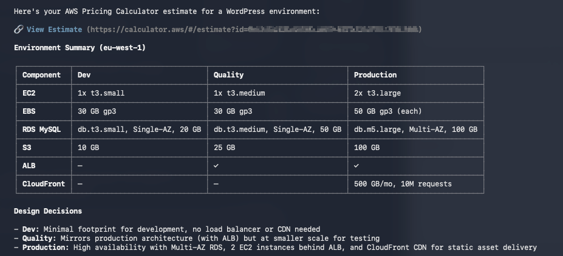

# AWS Pricing Calculator MCP Server

[Model Context Protocol](https://modelcontextprotocol.io) (MCP) server that creates, reads, and updates [AWS Pricing Calculator](https://calculator.aws/#/estimate) estimates through natural language.

[](https://kiro.dev/launch/mcp/add?name=aws-pricing-calculator-mcp-server&config=%7B%22command%22%3A%22npx%22%2C%22args%22%3A%5B%22-y%22%2C%22sample-aws-pricing-calculator-mcp%40latest%22%5D%7D) [](https://cursor.com/en/install-mcp?name=aws-pricing-calculator-mcp-server&config=eyJjb21tYW5kIjoibnB4IiwiYXJncyI6WyIteSIsInNhbXBsZS1hd3MtcHJpY2luZy1jYWxjdWxhdG9yLW1jcEBsYXRlc3QiXX0%3D) [](https://insiders.vscode.dev/redirect/mcp/install?name=aws-pricing-calculator-mcp-server&config=%7B%22command%22%3A%22npx%22%2C%22args%22%3A%5B%22-y%22%2C%22sample-aws-pricing-calculator-mcp%40latest%22%5D%7D)

## Key Features

- **Build estimates from natural language** - agent constructs the estimate via MCP tools; the server saves it to AWS Pricing Calculator and returns a shareable URL.
- **No AWS credentials required** - uses public, unauthenticated calculator.aws CDN endpoints.
- **Live service definitions** - fetches the AWS Pricing Calculator manifest at runtime (~436 services).
- **Verified Configs Catalog** - 16 per-service entries declaring the smallest config that produces a priced estimate, with documented gotchas.
- **Lint refusal before save** - refuses estimates the calculator would render read-only or required-input, with actionable recovery hints.
- **Import existing estimates** - download by URL or ID as JSON (for region swaps, modifications) or Markdown (for LLM analysis).
- **Two transport modes** - stdio (default, for local clients like Claude Desktop, Kiro, Cursor) and optional HTTP (`MCP_TRANSPORT=http`) for hosted deployments.

## Example

Prompt:
> Create an AWS Pricing Calculator estimate for a common Wordpress environment on AWS (Dev, Quality, Production).

Output:


## Quick Start

Requires [Node.js®](https://nodejs.org/en/download).

### Via npx (recommended)

The published package on npm runs without cloning:

```json
{
  "mcpServers": {
    "aws-pricing-calculator-mcp-server": {
      "command": "npx",
      "args": ["-y", "sample-aws-pricing-calculator-mcp@latest"]
    }
  }
}
```

Add this to your MCP client config (e.g. `~/.kiro/settings/mcp.json`, Claude Desktop's `claude_desktop_config.json`, Cursor's MCP settings, or the VS Code MCP config). The install badges above generate the right config automatically.

### From source

```bash
git clone https://github.com/aws-samples/sample-aws-pricing-calculator-mcp.git
cd sample-aws-pricing-calculator-mcp
npm install
npm run build
```

Then point your client at the built bundle:

```json
{
  "mcpServers": {
    "aws-pricing-calculator-mcp-server": {
      "command": "node",
      "args": ["/path/to/sample-aws-pricing-calculator-mcp/dist/mcp-server.js"]
    }
  }
}
```

## MCP Tools

| Tool | Description |
|---|---|
| `search_services` | Search AWS services by name or key. Supports comma-separated queries. |
| `get_service_fields` | Get input field IDs, types, labels, valid options, and selector values for one or more services. For curated services, the response includes a `catalog` block (`minimalConfig`, required-field hints, traps). For deprecated parent service codes (currently `amazonS3`), returns a `redirect_to_parent` status with `child_service_codes` listing the actual service codes to use instead. |
| `create_estimate` | Create a new empty estimate. Returns an estimate ID. |
| `add_service` | Add one or more services to an estimate. Validates field IDs and values against the live service definition (dropdowns, fileSize unit format, numeric/frequency types, region whitelist). Auto-corrects unambiguous mistakes (case mismatches, typos, number-to-string coercion) and returns a `corrections` array on the per-service result. Partial entries return a `partial: true` warning when required inputs are missing. |
| `validate_estimate` | Dry-run preflight: builds the would-be saved payload and runs a static check, without calling the save API. Returns `{lint_verdict, next_step, lint_services, would_be_payload}`. Use to confirm an estimate would render correctly before saving. |
| `build_estimate` | One-shot create + add services + lint preflight + save. Returns the shareable URL on success, or a structured envelope identifying which services need field discovery before retry. |
| `export_estimate` | Save the in-flight estimate to calculator.aws and return a shareable URL. Refuses with an actionable `next_step` if the static linter predicts the saved blob would rehydrate read-only. |
| `import_estimate` | Download an existing estimate by URL or ID. Returns JSON (raw) or Markdown. |
| `get_server_info` | Return version and capability information. |

## Project Structure

```
mcp-server.js              # Entry point — registers the 9 MCP tools, stdio + HTTP transports
lib/
  aws-client.js            # Manifest loading, service definitions, save/read APIs
  estimate-builder.js      # In-memory estimate model, AWS payload assembly
  ec2.js                   # EC2 agent-friendly → ec2Enhancement transform
  validation.js            # Pre-save config validation (field-id, value-shape, region, auto-correct)
  can-rehydrate.js         # Static rehydration linter (12 predicates, pure)
  can-rehydrate-fetch.js   # Network wrapper around the linter
  lint-hints.js            # Translates lint failures into agent-actionable next_step text
  catalog.js               # Loader for catalog/services/*.json curated entries
  pct-config.js            # PCT-based field suggestion
  surfaceability.js        # PCT-driven surfaceability index
  agent-fields.js          # Synthetic field surfacing for fields hidden in composite widgets
  dom-cost.js              # Playwright DOM scrape of the calculator's rendered cost
  handler-helpers.js       # Shared internals for the MCP tool handlers
  tool-descriptions.js     # Long agent-facing tool descriptions (separated from wiring)
  estimate-store.js        # Pluggable in-flight estimate store (memory default)
  estimate-store-dynamodb.js # DynamoDB-backed store for stateless multi-replica deployments
  trace-logger.js          # Structured JSON trace events on stderr
  trace-events.js          # Trace event name registry
  request-context.js       # Per-request session id propagation
catalog/
  schema.json              # JSON Schema for catalog entries
  services/                # Verified configs catalog (minimalConfig, traps, subServices)
test/                      # node:test suite
eval/                      # Scenario-driven behavior eval (87 stdio + LLM scenarios)
scripts/                   # Maintainer tools (catalog authoring, sweep, diagnostic)
dist/                      # Build output: mcp-server.js bundle, aws-calculator.zip, bundle-contract.json
```

The `lib/` listing is exhaustive at 1.2.0. The architecture diagram below highlights the load-bearing modules; minor helpers are not shown.

## Build

```bash
npm run build
```

Produces:
- `dist/mcp-server.js` — single-file esbuild bundle (CJS, minified, Node platform)
- `dist/aws-calculator.zip` — the bundle plus catalog files and runtime libs, zipped for hosted deployment
- `dist/bundle-contract.json` — describes the bundle's environment-variable surface (name, type, default, enum values) so downstream consumers can typecheck their CDK/Terraform against the actual surface

## Tests

Three layers, no overlap:

- **`npm test`** — node:test suite (424/429 pass with mocked I/O). Per-commit gate. Covers pure functions (validation, lint, surfaceability), payload construction, EC2 transforms, catalog schema.
- **`npm run validate-catalog:cost`** — sweeps verified catalog entries against the live cost oracle. Catches stale URLs and pricing-engine drift.
- **`python eval/run.py`** — 87 YAML scenarios (scripted MCP calls + LLM-driven). Each does a real save, then asserts on the saved blob (DOM-rendered cost, structural field equality, lint-must-pass). Run on demand (~1-2 min for stdio scenarios; LLM scenarios cost a few cents on Bedrock Haiku).

424/429 tests pass with mocked I/O (5 skipped, network-dependent). Set `SKIP_NETWORK=1` for offline runs.

## Architecture

```
┌─────────────────┐  stdio (default)    ┌──────────────────────────────────────┐
│   MCP Client    │◄───────────────────►│         MCP Server                   │
│ (Kiro, Claude,  │   JSON-RPC over     │                                      │
│  Cursor, etc.)  │   stdin/stdout      │  mcp-server.js (entry point)         │
│                 │   — or, with        │    ├── lib/aws-client.js             │
│                 │   MCP_TRANSPORT     │    ├── lib/estimate-builder.js       │
│                 │   =http, JSON-RPC   │    ├── lib/ec2.js (EC2 transform)    │
│                 │   over HTTPS        │    ├── lib/validation.js             │
└─────────────────┘                     │    ├── lib/can-rehydrate.js (lint)   │
                                        │    └── lib/catalog.js                │
                                        └──────┬─────────┬─────────┬──────────┘
                                               │         │         │
                                          GET  │     GET │    POST │
                                               ▼         ▼         ▼
                                       ┌─────────┐ ┌─────────┐ ┌─────────────┐
                                       │ CDN     │ │ CDN     │ │ Calculator  │
                                       │ manifest│ │ saved   │ │ Save API    │
                                       │ + svc   │ │ estimate│ │             │
                                       │ defs    │ │ read    │ │ POST        │
                                       │         │ │         │ │ /v2/saveAs  │
                                       │ d1qsj…  │ │ d3knq…  │ │ dnd5z…      │
                                       └─────────┘ └─────────┘ └─────────────┘
```

- **Default transport is stdio.** The MCP server runs as a local child process spawned by the MCP client; it is not network-accessible by default. Set `MCP_TRANSPORT=http` to expose it on `PORT` (default `8000`, `HOST` default `127.0.0.1`) for hosted deployments — the operator is responsible for placing it behind appropriate authentication and network controls.
- All outbound requests are **HTTPS to public, unauthenticated AWS CloudFront distributions** — the same hosts the calculator.aws website uses. No AWS credentials are required for the default in-memory store. The optional DynamoDB store opens a fourth outbound path to DynamoDB and requires AWS credentials with the IAM permissions noted in [Estimate persistence](#estimate-persistence).
- Estimate data is held **in memory only by default** (lost when the process exits). Switch to `ESTIMATES_STORE=dynamodb` to persist in-flight estimates across replicas.

## How It Works

### Service discovery

On first use, the server fetches the AWS Calculator manifest from CloudFront (~436 services with their keys, names, and definition URLs). Service definitions are fetched on demand and cached. The `get_service_fields` tool parses these definitions to extract input field IDs, types, labels, and valid options into a flat, usable format.

### Estimate building

`EstimateBuilder` holds services and groups in memory (or in DynamoDB if configured). When `add_service` is called, the config is validated against the live service definition and stored using the AWS field IDs. Services can be organized into named groups, and multiple instances of the same service are supported via composite keys (e.g. `aWSLambda:Compute`).

### EC2 handling

EC2 uses a custom config transform (`lib/ec2.js`) that converts agent-friendly fields (instance type, OS, pricing strategy) into the `ec2Enhancement` format the calculator expects. Supports On-Demand, Savings Plans, Reserved Instances, and Spot pricing.

### Partition support

The server supports three AWS partitions:
- `aws` — standard commercial regions
- `aws-iso` — US ISO East/West
- `aws-iso-b` — US ISOB East

### Export to calculator.aws

When `export_estimate` is called, the server:

1. Resolves each service name against the manifest.
2. Fetches the service definition to get the correct `version`, `serviceCode`, and template ID.
3. Maps config keys to `calculationComponents` in the AWS payload format.
4. Runs the rehydration linter against the would-be saved blob. If it predicts read-only, the call is refused with an actionable recovery hint instead of a URL.
5. POSTs the payload to the AWS Calculator save API.
6. Returns the shareable `calculator.aws` URL.

AWS recalculates the actual costs when someone opens the link.

## Environment Variables

All optional. The full set is also documented machine-readably in `dist/bundle-contract.json` after build.

| Variable | Default | Purpose |
|---|---|---|
| `AWS_SAVE_URL` | CloudFront save URL | Override the AWS Calculator save endpoint (testing only). |
| `MCP_TRANSPORT` | `stdio` | `stdio` or `http`. HTTP listens on `PORT` (default `8000`) bound to `HOST` (default `127.0.0.1`). |
| `ESTIMATES_STORE` | `memory` | In-flight estimate store. See [Estimate persistence](#estimate-persistence). |
| `ESTIMATES_TABLE` | — | DynamoDB table name. Required when `ESTIMATES_STORE=dynamodb`. |
| `ESTIMATES_TTL_SECONDS` | `0` | TTL for DynamoDB-stored estimates in seconds. `0` = no TTL. |
| `TRACE` | `off` | Set to `on` (or `1`/`true`/`yes`) to enable structured stderr trace events. See [Trace events](#trace-events). |
| `TRACE_RESULT_TEXT_MAX` | `500` | Cap on `resultText` length when tracing is enabled. |

## Estimate persistence

The MCP server keeps in-flight estimates (between `create_estimate` and `export_estimate`) in a pluggable store. Configure with `ESTIMATES_STORE`:

| Value | Description |
| --- | --- |
| `memory` (default) | In-process `Map`. State is lost when the process exits. Suitable for stdio and single-process deployments. |
| `dynamodb` | Persists snapshots in a DynamoDB table. Required for any deployment where `create_estimate` and `add_service` may run in different processes (multi-replica HTTP, Lambda, container runtimes with non-sticky session routing). |

### `dynamodb` configuration

The AWS SDK packages are NOT bundled with the published artifact (they are declared as optional peer dependencies). Before running with `ESTIMATES_STORE=dynamodb`, install them in your deployment image:

```bash
npm install @aws-sdk/client-dynamodb @aws-sdk/lib-dynamodb
```

Required env vars when `ESTIMATES_STORE=dynamodb`:

| Variable | Required | Description |
| --- | --- | --- |
| `ESTIMATES_TABLE` | Yes | DynamoDB table name. |
| `AWS_REGION` | Yes | AWS region for the DynamoDB client. |
| `ESTIMATES_TTL_SECONDS` | No | If set, items are written with an `expiresAt` attribute equal to `now + ESTIMATES_TTL_SECONDS`. Pair this with a TTL configuration on the table (TTL attribute name: `expiresAt`) to expire abandoned estimates automatically. |

### Table schema

```
TableName: <ESTIMATES_TABLE>
PartitionKey: id (String)
Attributes:
  id        (String)  the estimate's UUID
  snapshot  (String)  JSON-encoded snapshot of the estimate
  expiresAt (Number)  optional epoch seconds, populated when ESTIMATES_TTL_SECONDS is set
TTL attribute: expiresAt  (configure on the table if you set ESTIMATES_TTL_SECONDS)
```

The IAM role running the server needs `dynamodb:GetItem`, `dynamodb:PutItem`, and `dynamodb:DeleteItem` on the table.

### Implementation notes

- Each estimate is stored as a single JSON string under one item. Estimates that approach DynamoDB's 400 KB per-item cap (hundreds of services) will fail to write — use S3 or chunk-encoding if you need that.
- The store is constructed once at process start. Switching backends requires restarting the process.

## Verified Configs Catalog

The catalog (`catalog/services/*.json`) is a set of curated per-service entries. Each entry declares:

- `minimalConfig` — the smallest config that produces a priced editable estimate
- `required[]` — pricing-engine-required fields (often broader than the manifest's `validations.required: true`)
- `optional[]` — documented hints with examples
- `traps[]` — free-text gotchas the manifest can't express (e.g. "Step Functions' frequency unit MUST be `perMonth`, not `millionPerMonth`")
- `subServices[]` — child routing for sub-service-selector parents (e.g. S3 storage classes, Bedrock models)

`get_service_fields` returns this metadata in a `catalog` block when an entry exists, so the agent doesn't have to guess.

### Coverage

| Status | Count | Meaning |
|---|---|---|
| `verified` | 16 | Reverified end-to-end: a fresh save from `minimalConfig` renders non-zero cost in calculator.aws |
| `partial` | 1 | Authored but not fully verified |
| **Total entries** | **17** | Out of ~436 services in the manifest |

The verified entries cover the highest-impact services from production usage analysis: Lambda, RDS PostgreSQL, ALB, Fargate, EC2, NAT Gateway, Transit Gateway, CloudTrail, Direct Connect, Cognito, S3 (storage classes), SNS, SageMaker, Bedrock, AppSync, and Step Functions.

### Why not catalog every service

Catalog entries are work to author and maintain. They earn their place when the manifest underdeclares what the pricing engine actually needs (the silent-$0 trap class). For services where the manifest is sufficient, no entry is needed — the agent reads the manifest, sends fields, the calculator prices them.

`scripts/diagnose-service.js` runs the falsifiable test: probe each un-cataloged service and classify it. Useful when scoping new catalog work.

### Validating the catalog

```bash
npm run validate-catalog          # JSON Schema check (runs in npm test)
npm run validate-catalog:cost     # Sweeps verified entries against the live cost oracle
```

The cost-oracle sweep saves a fresh estimate from each verified entry's `minimalConfig` and confirms it renders ≥$0.01/mo via the DOM oracle (`lib/dom-cost.js`). Run on a cadence (manual / cron / pre-deploy) to catch stale URLs and pricing-engine drift.

### Catalog quality

The 1.2.0 catalog content was audited along three independent axes before release.

**Cost-rendering correctness (deterministic).** The `validate-catalog:cost` sweep saves each of the 16 verified entries' `minimalConfig` and confirms a non-zero rendered cost via the DOM oracle. Result: **16/16 entries render priced cost** (e.g. Lambda $699.80/mo, RDS PostgreSQL $175.75/mo, EC2 $70.08/mo).

**Trap content audit (manifest cross-check + LLM cold-eye).** Each `traps[]` claim was checked against the live manifest data and, where applicable, the saved blob of the corresponding `verifiedEstimateId`. Result across the 60 shipped traps: **0 hallucinated claims**. Every trap was then classified by the type of utility it provides to a runtime agent — falling roughly into:

- **Prevents save-failure** — without the trap, the agent's save fails (lint refusal, value validation, sub-service-selector rejected). The largest category.
- **Prevents silent-zero** — save+lint pass but cost renders $0 without the trap. The catalog's most distinctive value class.
- **Steers selection** — empirically demonstrated by a probe scenario, manifest-derived (mechanism visible to `get_service_fields`), or a well-known AWS pricing fact (Multi-AZ doubles cost, etc.).

5 traps that classified as "author-only" or "unverifiable prose" were removed before release rather than shipped to agents.

**Agent-success measurement (empirical, paired drift audits).** The `eval/scenarios/cat-<svc>-with.yaml` / `cat-<svc>-without.yaml` pairs run the same prompt twice — once with the catalog active, once with it removed — and compare outcomes. As of the 1.2.0 eval run with Bedrock Haiku 4.5: **6 services demonstrate measurably better agent success with the catalog** (ALB, CloudTrail, Direct Connect, EC2, Fargate, Transit Gateway — `with` passes, `without` fails). 2 are redundant (manifest alone is sufficient: AppSync, NAT). 8 produce mixed results that depend on agent prompt-following behavior; for those services the catalog still provides correct content (verified by the cost sweep above) but the marginal effect on a specific LLM run isn't deterministic.

The trap audit and earns-place data are summarized here for transparency; the deterministic cost sweep is the load-bearing correctness gate.

## Known Issues

- The CloudFront save/manifest APIs are undocumented and may change without notice.
- Callers must use the correct AWS field IDs — discover them via `get_service_fields`.
- The server discovers applicable selector values but cannot resolve cross-field dependencies (e.g. EC2 Instance Types ↔ License).
- With the default `memory` store, in-flight estimates don't persist across restarts. Use `ESTIMATES_STORE=dynamodb` for stateless or multi-replica deployments.
- No local cost calculation — pricing is computed by AWS when viewing the shareable link. Press **Update estimate** in the calculator UI to reflect the latest pricing.
- Only `https://calculator.aws/` is supported.
- Catalog coverage is partial (16 verified entries against ~436 manifest services). Uncatalogued services still benefit from the lint and trace events; they just don't get the magnitude-calibration role the catalog plays.

## Security

This is sample code intended for educational purposes. You should work with your security and legal teams to meet your organizational security, regulatory, and compliance requirements before deployment.

### Security model

This MCP server is a **local tool provider** — by default it runs as a child process of an MCP client over stdio and is not network-accessible. It has no authentication or authorization layer; access control is the responsibility of the MCP client that spawns it. When `MCP_TRANSPORT=http` is enabled, the operator is responsible for placing the server behind appropriate authentication and network controls.

The server does not handle AWS credentials (in the default `memory` mode), customer data, or PII. It processes only pricing configuration parameters (region, instance type, request counts) provided by the MCP client. The DynamoDB store does require AWS credentials with the listed IAM permissions; the server itself never reads or stores the calling user's AWS account data.

The save and manifest endpoints are the same public, unauthenticated CloudFront distributions used by the [calculator.aws](https://calculator.aws) website.

### Input validation and sanitization

- All MCP tool inputs are validated using [Zod](https://zod.dev/) schemas before processing.
- User-provided descriptions and group names are sanitized to remove `<`, `>`, and `&` characters before inclusion in API payloads, preventing HTML/XML injection in the calculator frontend.
- Service configuration keys and values are validated against the live service definition (typo detection via Levenshtein distance, dropdown options against enums, fileSize unit format, region whitelist) before payload construction.

### Data handling

- Estimate data is held **in memory only by default** for the lifetime of the process. With `ESTIMATES_STORE=dynamodb`, estimates are persisted to a customer-owned DynamoDB table (the operator owns the data lifecycle).
- The data consists of pricing configuration (region codes, service parameters, instance types) — not secrets, credentials, or personally identifiable information.
- Shareable URLs generated by export contain only an opaque estimate ID. The estimate content is stored by AWS, not by this server.

### Reporting security issues

See [CONTRIBUTING](CONTRIBUTING.md#security-issue-notifications) for information on reporting security issues.

## Trace events

When tracing is enabled (`TRACE=on`), the server emits structured JSON lines on stderr, one per event, for every tool call and save operation. Hosted deployments typically capture these via the runtime's log pipeline; in stdio mode they appear on the process stderr directly.

**Tracing is off by default.** Set `TRACE=on` (or `1`/`true`/`yes`) to enable. The default keeps stderr quiet for local CLI use.

Each line carries `ts` (ISO timestamp), `event` (one of the names below), and an `mcpSessionId` field when the call was made over HTTP transport.

| Event | Payload fields | When emitted |
|---|---|---|
| `tool.call` | `name`, `args`, `mcpSessionId?` | Tool handler entry |
| `tool.result` | `name`, `isError`, `resultText` (≤500 chars), `resultLength` (pre-truncation), `durationMs`, `mcpSessionId?` | Tool handler exit (success or error) |
| `lint` | `verdict`, `services`, `estimateId?`, `mcpSessionId?` | After the rehydration linter runs in `export_estimate` / `build_estimate` |
| `save.send` | `bytes`, `groupCount`, `serviceCount`, `estimateId?`, `mcpSessionId?` | Before POST to AWS save API |
| `save.ok` | `savedKey`, `estimateId?`, `mcpSessionId?` | Save API returned 200 |
| `save.fail` | `status`, `body` (≤500 chars), `estimateId?`, `mcpSessionId?` | Save API returned non-200 |
| `session.start` | `mcpSessionId?` | New MCP session opened (HTTP transport) |

`tool.call` and `tool.result` are paired — sort by `ts` to reconstruct the sequence. `save.*` events sit between them on `export_estimate` / `build_estimate` calls.

`resultText` is truncated to keep log volume bounded; `resultLength` is the original (pre-truncation) length. Set `TRACE_RESULT_TEXT_MAX=<N>` to raise the cap when investigating a clipped response.

### Customer-text redaction

Trace events are typically captured to log groups that may be queryable by anyone with read access. To keep agent-supplied free text out of those logs, the trace logger redacts values at known-sensitive keys before emit:

- `name` — estimate names from `create_estimate` / `build_estimate`
- `description` — per-service free-text labels from `add_service` / `build_estimate` / `import_estimate`

Both fields are replaced with `[redacted: <N> chars]` in `tool.call` args and `tool.result` resultText. Structure is preserved (you still see "the agent set a description") but the content isn't. `resultLength` reflects the original pre-redaction length. Non-sensitive fields — service codes, region IDs, field IDs, numeric values, UUIDs — pass through untouched.

To extend redaction for a new sensitive field, add the key to `SENSITIVE_KEYS` in `lib/trace-logger.js`. The redactor walks nested structures recursively, including the JSON-stringified `services` arg of `add_service` / `build_estimate`.

The `mcpSessionId` field has three states, useful for telling transports apart:

- HTTP request with an `mcp-session-id` header → `"mcpSessionId": "<uuid>"`
- HTTP request without the header → `"mcpSessionId": null`
- Stdio transport → field omitted entirely

## AWS MCP Servers Comparison: Pricing & Cost Management

| | **AWS Pricing Calculator MCP (This)** | **[AWS Billing & Cost Management MCP](https://github.com/awslabs/mcp#-cost--operations)** | **[AWS Pricing MCP](https://github.com/awslabs/mcp#-cost--operations)** |
|---|---|---|---|
| **Purpose** | Build shareable cost estimates for new workloads | Analyze historical spend & optimize existing costs | Query real-time pricing data from Price List API |
| **Data Source** | AWS Pricing Calculator (calculator.aws) | Cost Explorer, Cost Optimization Hub, Compute Optimizer, Savings Plans, Budgets, Storage Lens | AWS Price List Bulk API |
| **Output** | Shareable calculator.aws URL with full estimate | Natural language cost insights, savings recommendations | Raw pricing data, cost reports (markdown/CSV) |
| **Use Case** | "What will this new architecture cost?" | "Where am I overspending today?" | "What's the per-unit price of X?" |
| **Scope** | Forward-looking estimates | Historical & current spend | Current catalog pricing |
| **AWS Credentials** | Not required (uses public calculator API) | Required (reads your billing data) | Required (`pricing:*` permissions) |

TL;DR: Use the Pricing Calculator MCP to build estimates for proposals, the Billing & Cost Management MCP to analyze and optimize existing spend, and the Pricing MCP for granular unit-price lookups and IaC cost analysis.

## Changelog

See [CHANGELOG.md](CHANGELOG.md) for the full release history.

## License

This library is licensed under the MIT-0 License. See the [LICENSE](LICENSE) file.

## Disclaimer

Before using an MCP Server, you should consider conducting your own independent assessment to ensure that your use would comply with your own specific security and quality control practices and standards, as well as the laws, rules, and regulations that govern you and your content.
